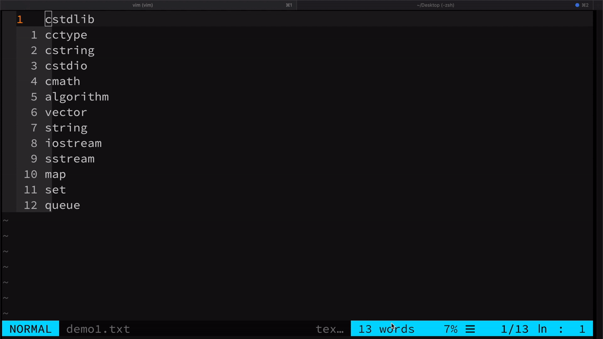
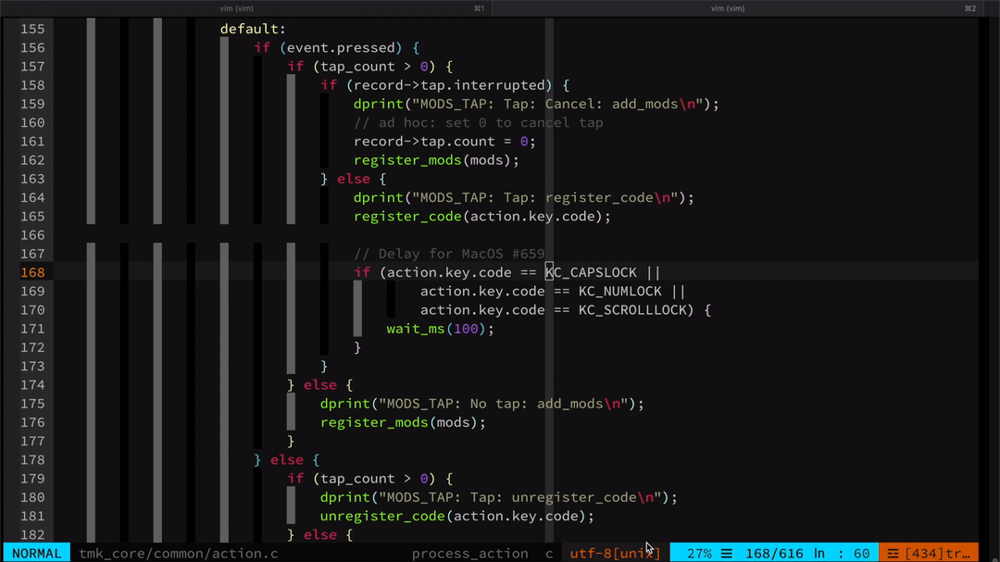
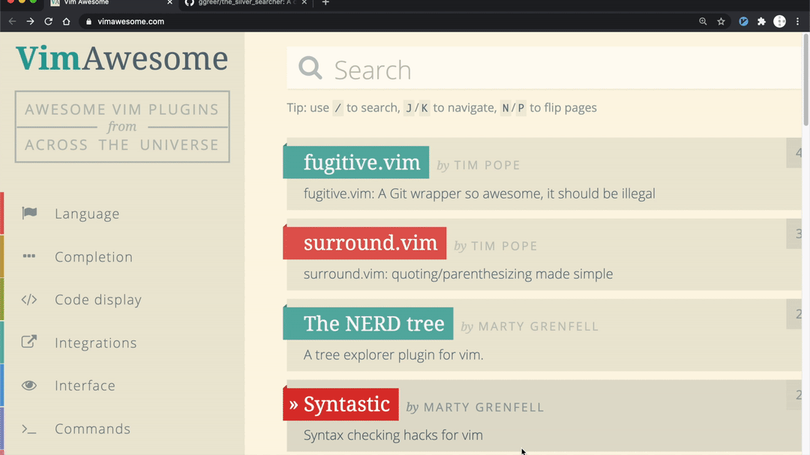
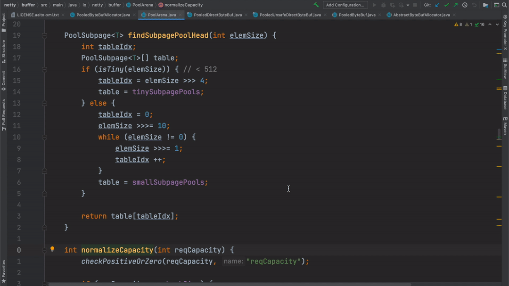
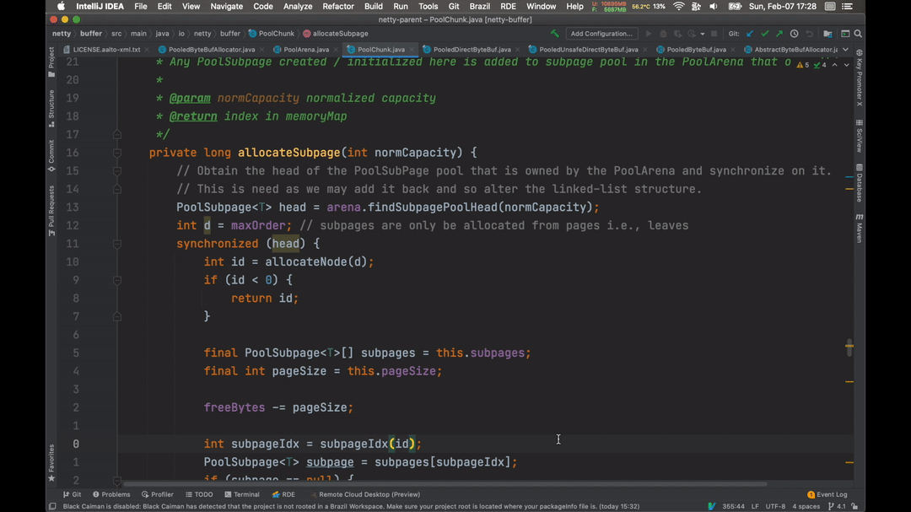
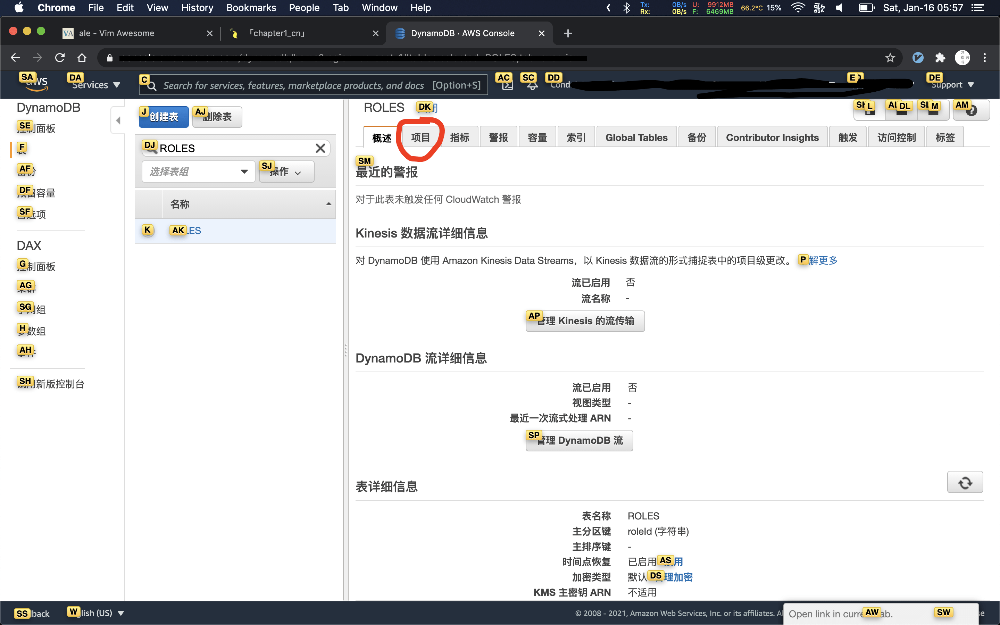

# 为什么要做一把蓝牙机械键盘

## 系列文章列表
* [为什么要做一把蓝牙机械键盘](./chapter1_cn.md)
* [用到的东西](./chapter2_cn.md)
* [制作左手](./chapter3_cn.md)
* [设置左右手蓝牙BLE](./chapter4_cn.md)
* [制作右手](./chapter5_cn.md)
* [轴体焊接及供电模块](./chapter6_cn.md)
* [后记](./chapter_tips_cn.md)

下面是一系列文章, 讲怎么自己做一把蓝牙版的ergodone键盘. 

## 背景
为什么要做这样一把键盘呢？
因为我是程序员, 也是vim的使用者, 现在在用的是mac系统, 更喜欢用键盘来进行一些操作, 不喜欢把手移动到鼠标上进行一些操作, 再移到回键盘上. 除了可以用软件或者系统的快捷键, 现在很多环境下, 都有vim的插件, 比如chrome的浏览器有Vimium, zsh里有vi-mode, 文件管理可以用[ranger](https://github.com/ranger/ranger/), intellj里[IdeaVim](https://plugins.jetbrains.com/plugin/164-ideavim). Mac系统里有[vimac](https://github.com/dexterleng/vimac/), 使得用键盘操作电脑, 成为一种可能. 

当然, 比如剪视频这种工作, 必须还是有鼠标来得方便, 但是程序员的日常生活里, 这类情况比较少, 也可以用mac自带的触控板解决. 

虽然有各种vim软件插件的加持, 但是还是遇到了很难回避的问题. 单靠软件, 并不能达到我预期的效果. 所以想从硬件方面解决一些问题, 才有了自己做一把键盘的想法. 

## 强大的vim
先介绍一下我使用的vim的一些操作习惯. 

vim的学习成本很高, 学习曲线也很陡峭, 但是是一个功能非常强大的文本编辑器, 加上各种插件, 甚至可以是IDE, Markdown编辑器……

我除了写java会用intellij, 因为写java工程对代码补全要求非常高, 需要下载并且使用各种第三方依赖库. 写其他语言诸如python, javascript, html, C, C++等, 基本上都用vim. 

下面展示一些各种vim的奇技淫巧. 

### 终端下的vim

1. 记录一系列操作, 并回放, 比如下面gif显示的, 记录下我第一行的操作, 然后把这个操作, 应用到剩下的12行里. 

2. 使用插件[fzf](https://github.com/junegunn/fzf.vim), 加上[The Silver Searcher](https://github.com/ggreer/the_silver_searcher), 我可以方便地在项目里, 用正则表达式搜索文本, 比如我想找以KC_CAPSLOCK为结尾的某一行文本 (这也是我很想吐槽intellij的一点, 搜索字符串不太方便, 特别是在配置文件里的字符串) . 

3. 使用c.vim可以方便地编辑运行C语言, 如果能将vim的开发环境打包成docker, 上传到自己租的云服务器, 然后用ipad连接上这个云服务器, 你就可以在ipad上写点代码, 其他语言类似, 不过ipad上有一个很郁闷的地方, 一直按住backspace键, 能一直删除, 一直按住字母键, 比如j, 只会生效一次, 这就导致在ipad上不能一直按住j来不断让光标下移, 幸好有插件[vim-easymotion](https://github.com/easymotion/vim-easymotion)可以缓解这种冲突. 

### Chrome浏览器里的vimium插件

   使用插件打开超链接, 编辑当前的URL并在新标签页打开, 然后在各种标签页跳转

### Intellij里的IdeaVim插件
   使用[IdeaVim-EasyMotion](https://plugins.jetbrains.com/plugin/13360-ideavim-easymotion)快速在代码中跳转, 并且可以映射一些操作, 比如我这里使用;su来找到这个函数在哪里被调用了即ShowUsages. 

### Mac里的软件Vimac
使用[vimac](https://github.com/dexterleng/vimac/), 像浏览器里的vimium插件类似, 可以替代鼠标的一些操作. 
比如我用键盘打开intellij的File选项卡. 

### Ranger文件管理器
可以用vim类似的命令, 在终端里进行文件的各种操作. 比如可以预览一些文本文件, 图片, 视频也可以预览不过我没有配置. 可以在各种位置打tag, 在tag之间进行跳转, 比如我通过tag跳转到项目文件夹, 复制了一个文件, 然后粘贴到桌面文件夹, 然后再删除. 还有一些方便的功能, 比如批量重命名文件. 

### Zsh里的vi-mode
可以用vim类似的命令去编辑shell命令

## 还是有问题
1.  网页上可以用鼠标点击的地方, 有时候插件不能识别到. 比如DynamoDB控制台里的"项目". 这时候就得用鼠标移上去, 再点一下.  
2.  zsh可以输入一些命令的前缀, 按向上方向键, 可以搜索输入历史里, 这个前缀的命令. 这要求把手移动到方向键的位置. 当然, 可以用别的快捷键, 比如\<Ctrl-P>来替代这种情况下的向上方向键, 但是有些情况下, 其他软件并不能自定义, 并且顺手的快捷键组合有限. 
 

## 解决方法
### 软件
让键盘可以去移动鼠标, 比如vim的命令里, hjkl这四个按键在普通模式下, 可以用来移动光标 (在输入模式下是正常输入字母) , 借鉴这样的思想, 我们可以新建自己的模式, 这个模式下hjkl是移动鼠指针. 在另一种模式下, hjkl变成上下左右方向键. 如果是在linux下, 可以通过修改系统配置 (参考[X_keyboard_extension](https://wiki.archlinux.org/index.php/X_keyboard_extension)) , 自定义键盘布局. 如果是在mac下, 有一个神器[Karabiner-Elements](https://github.com/pqrs-org/Karabiner-Elements), 并且有别人写好的配置[rules](https://ke-complex-modifications.pqrs.org/), 你可以轻松的让键盘变成你的样子. 比如我按下CAPSLOCK, hjkl就会移动鼠标指针, 按下CAPSLOCK+SHIFT, hjkl就会是上下左右的方向键. 

但是最后的效果, 还是不让人满意, 因为我的输入法SHIFT会切换中英文, 而且不能设置左或者右SHIFT才触发这个操作, 所以用CAPSLOCK+SHIFT, 经常误触发中英文切换, 而且原来键盘上已经有很多快捷键, 想一个没有冲突的, 比较费事, 所以光靠软件, 也不能让人满意. 
### 软件加硬件
如果键盘上多了几个我可以自定义的按键, 那个上面的问题就可以解决, 同时, 我也想让自己的键盘符合一些人体工程学, 最后挑中了ergodone (是在[ergodox](https://www.ergodox.io/)的基础上改进而来, 为了节省成本) , 有两个小的键盘组成, 这样两只手可以比较自然地放下. 
并且我希望能做到如下几个方面：
* 由于ergodone是有线版本, 我希望他是蓝牙无线的, 包括左右手的连接, 右手 (当然也可以是左手) 和电脑的连接, 都是用蓝牙. 
* 能够以后方便地更换故障的部分, 或者升级部分硬件. 
* 单纯右手就是一件独立的键盘, 不需要左右手合在一起才能用
* 能够使用成熟的键盘固件, 比如tmk_keyboard
* 能够方便地更新键盘上的程序
* 能够连接上多种类型的设备, 电脑, ipad, 手机等
* 键盘上有个摇杆或者轨迹球之类的设备可以用来方便地移动鼠标指针. (可选)

需要声明的是, 我本身是偏服务器方向的程序员. 我在做这个键盘之前, 完全没有任何硬件相关的知识, 所有跟硬件相关的知识, 包括跟硬件相关的软件知识 (即嵌入式编程) , 都是从网上学的, 或者问朋友的. 所以有哪里做得不对, 麻烦不吝赐教. 

