# 用到的东西

## 目录
* [为什么要做一把蓝牙机械键盘](./chapter1_cn.md)
* [用到的东西](./chapter2_cn.md)
* [制作左手](./chapter3_cn.md)
* [设置左右手蓝牙BLE](./chapter4_cn.md)
* [制作右手](./chapter5_cn.md)
* [轴体焊接及供电模块](./chapter6_cn.md)
* [后记](./chapter_tips_cn.md)

## 硬件相关
#### 焊接工具
* **电烙铁**
* **烙铁架**
* **高温海绵**: 在水中充分浸泡, 挤干后放置在烙铁架
* **焊锡**
* **松香**: 助焊剂, 焊出来的点比较亮, 不容易虚焊
* **吸锡枪**: 如果焊坏了, 将焊点的焊锡吸走, 重新焊
* **电工黑胶带**: 有时候用胶带辅助固定比较好焊
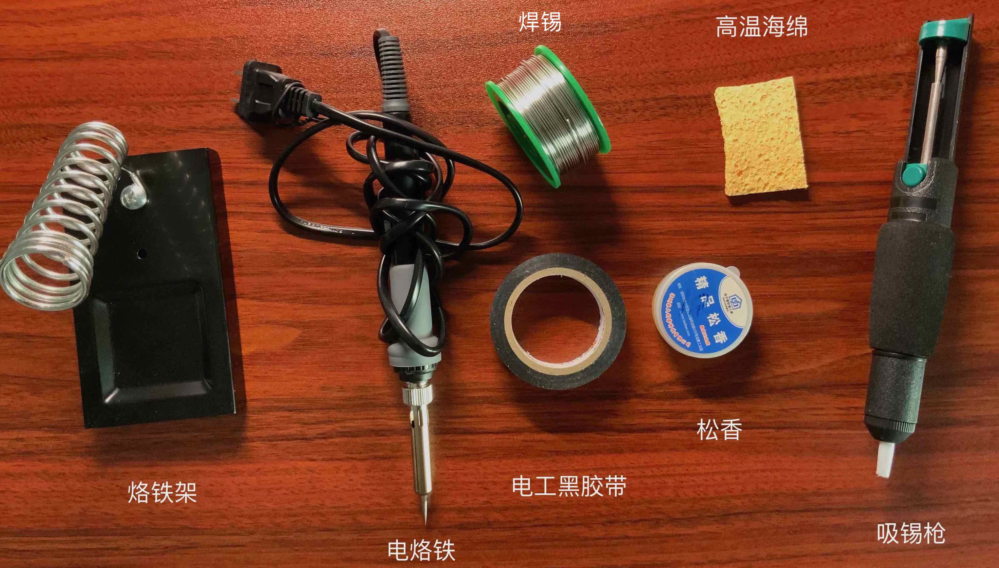

#### PCB板等
* **PCB板**: github上有PCB图纸[ErgoDone](https://github.com/ktec-hq/ErgoDone), 需要找淘宝店打印, 用软件[kicad](https://kicad.org/)打开具体的文件查看PCB图纸
* **1n4148二极管 * 76**: 规定电路板上电流的走向, 避免按一个键, 电流走到其他路径, 导致其他按键也认为被触发了, 可以多买些.
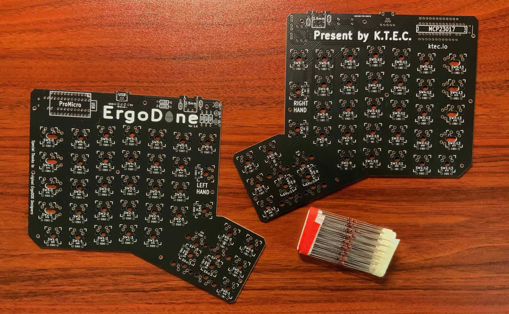

### 键盘轴体键帽等
* **喜欢的轴休 * 76**: 比如我这里大部分是茶轴, 几个是青轴
* **键帽**: 4个2U的, 12个1.5U的, 60个1U的, 这里我用的白色无刻的
* **PCB卫星轴2U * 4**: 在焊轴前, 安装和调试好卫星轴
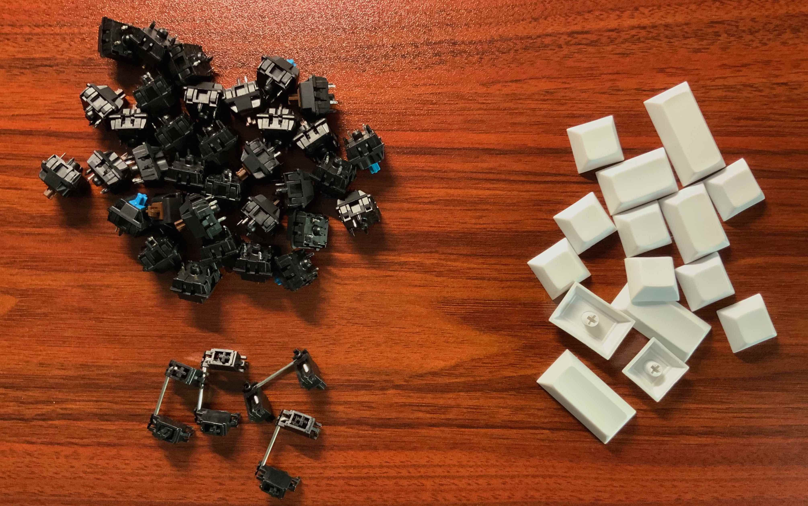

### 芯片等
* **Arduino Pro Micro * 2**: 左右手各一块, 主控芯片, 其他名字有min leonardo, ATMEGA32u4. 从淘宝上买, 一般会送直脚排针
* **MCP23017**: IO扩展模块，因为右手需要接入多块芯片或模组及处理键盘事件, 导致IO口不够, 所以用这个来扩展IO口. 使用说明[datasheet](https://pdf1.alldatasheetcn.com/datasheet-pdf/download/195324/MICROCHIP/MCP23017.html), 需要配合2.2K欧的电阻使用.
* **2.2K欧色环电阻 * 2**: 配合MCP23017使用
* **HM-10带底板 * 2**: 左手的Arduino Pro Micro将识别出来的按键事件发送给左手的HM-10, 然后左手的HM-10通过蓝牙将事件发送给右手的HM-10, 右手的HM-10发送给Arduino Pro Micro, 然后发送Bluetooth HID模组
* **Bluetooth HID模组**: HC-03带底板, 这里用的HC-03刷上RN42的固件, 用来给电脑发送鼠标键盘事件, 可以自己制作, 参考[教程](https://mitxela.com/projects/bluetooth_hid_gamepad), 也可以直接从淘宝上买
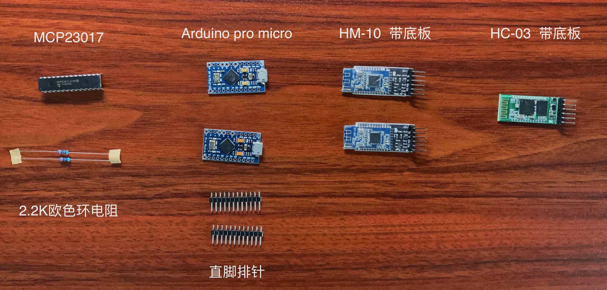

### 电源模块相关
* **锂电池 * 2**: 用来给芯片供电, 厚度不要超过6mm, 这里我选了一个厚度6mm, 宽度6mm, 长度10mm, 5000mAh, 并且带保护板的电池
* **TP4056充电模块 * 2**: 用来给锂电池充电, 我选的type c口的
* **拨动开关 * 2**: SS12D10, 用来控制电源的开关
* **易拉胶 * 2**: 用来固定电池, 使用易拉胶可以方便以后更换电池, 这里我用是苹果6P的易拉胶
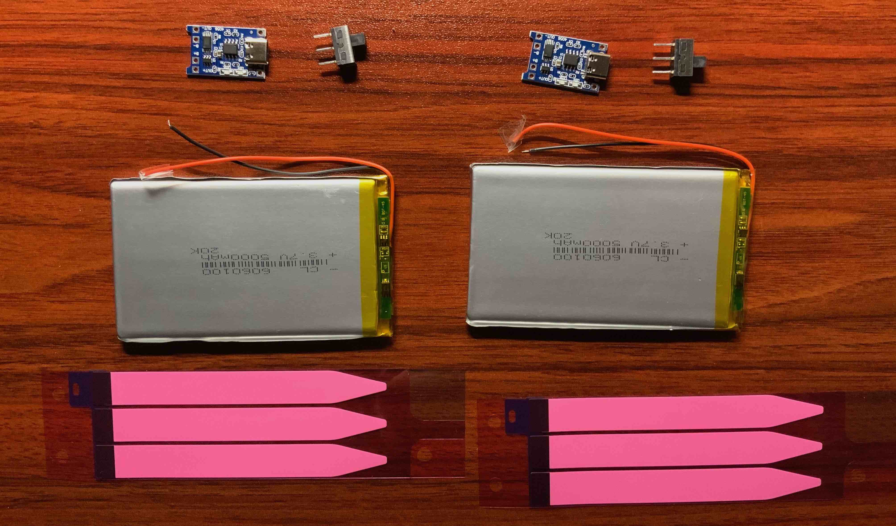

### 外壳等
* **亚克力外壳**: 我在键盘上加了摇杆, 这是可选的, 如果不想要摇杆, 可以使用这个[不带摇杆的CAD图纸](./cad/Bluetooth_Ergodone_without_joystick.dwg),  如果你也想加上摇杆, 用这个[带摇杆的CAD图纸](./cad/Bluetooth_ErgoDone_with_joystick.dwg), 材料是亚克力, 同样需要找淘宝店加工, 费用大概在120元左右. 可以用AutoCAD打开并编辑这样的文件, 新用户有30天试用, 还是比较方便的. 把膜撕了之后, 就是右手透明的样子, 很好看.
* **M2双通铜柱19MM * 14**: 用来固定外壳
* **M2螺丝8MM * 28**: 用来固定外壳
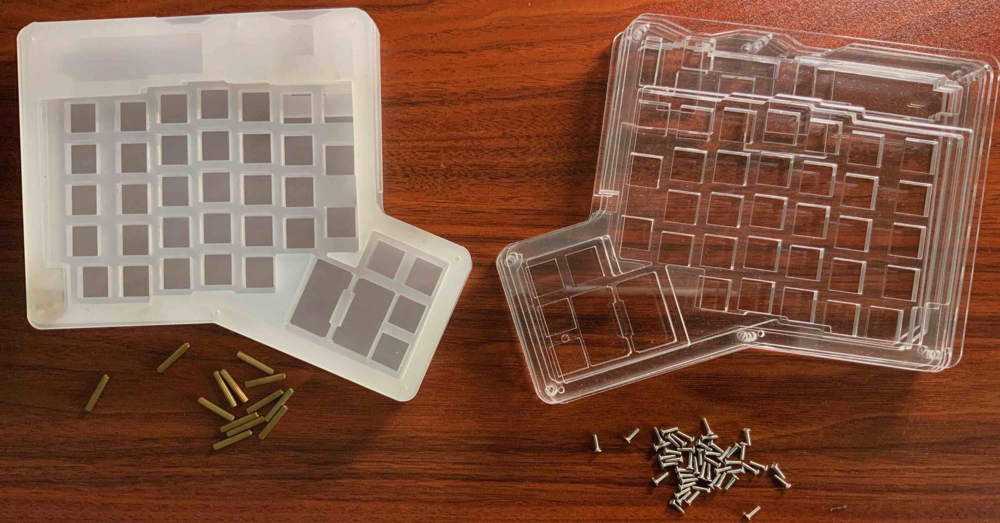

####  连接线
* **弯脚排针**: 为了避免直接用跳线焊接到芯片或者模组的引脚上, 先焊接上排针, 然后用杜邦线连接, 方便以后更换芯片, 如果觉得不牢靠, 可以用黑胶布再固定一下
* **母对母杜邦线**: 用来连接芯片模组和PCB等. 我用到了10CM, 15CM 20CM三种长度的. 当然也可以直接用跳线焊死, 就不用上面的弯脚排针了. 可以买一个公对公的杜邦线, 在没有焊上轴之前, 当成导线测试二极管焊得对不对.
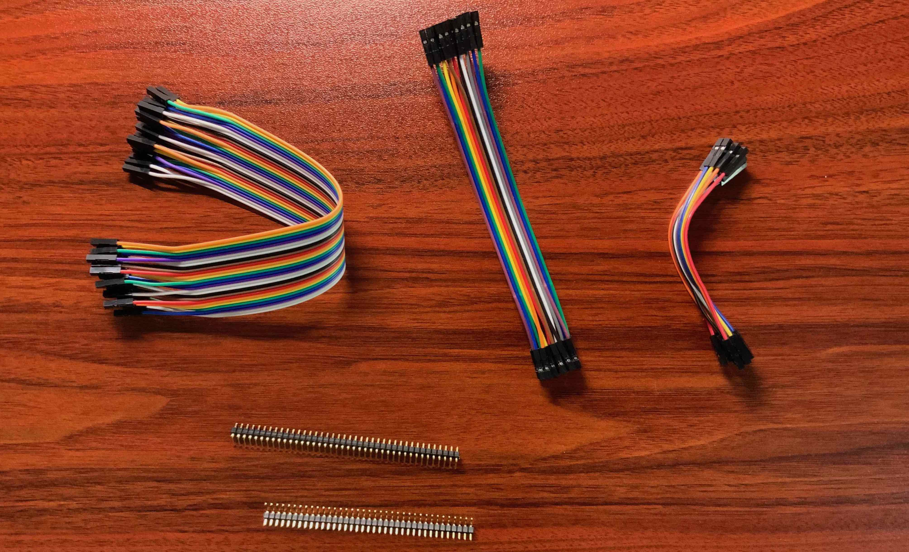

### 其他
* **USB转Micro USB * 2**: 在测试的时候, 同时给两块Arduino Pro Micro供电需要用到.
* **330欧色环电阻 * 3**: 避免电流过大烧坏LED灯.
* **234 LED方灯 * 3**: 放在键盘上, 可以用来提示CAPS_LOCK, 或者自定义提醒键盘布局变化.
* **纳米双面胶**: 用来固定芯片或者模组, 粘在外壳上

### 可选
* **摇杆**: 用来控制鼠标, 类似于thinkpad上的小红点
* **小红帽**: 因为上面的摇杆自带的摇杆帽太高了, 使用起来不舒服,所以用thinkpad小红点上的小红帽替代, 也可以先试试原装的蘑菇帽, 觉得不行了, 再换成小红帽试试(可惜没有矮点的蘑菇帽, 原装的蘑菇帽手感非常 好), 不是成熟的方案, 我自己也不满意, 如果有更好的方案, 请指教.
* **502胶水**: 因为小红帽和摇杆不匹配, 塞了点东西, 用脱水粘上
* **隐形笔记本支架**: 让键盘有一个比较舒服的角度
* **鼠标垫**: 因为加了一块电池的键盘太厚了, 所以加了鼠标垫拖着手, 一手一块不够厚, 所以一手两块
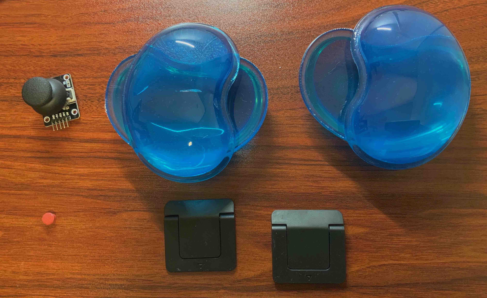
* **阳极铝定位板**: 我在使用中摔过一次, 定位板碎了, 因为定位板是和PCB板焊在一起的, 更换起来很麻烦,  所以这次用了金属材料, 阳极氧化铝, 如果你也需要, 可以用这个[定位板的图纸](./cad/positioning_plate.dwg), 其他不变.
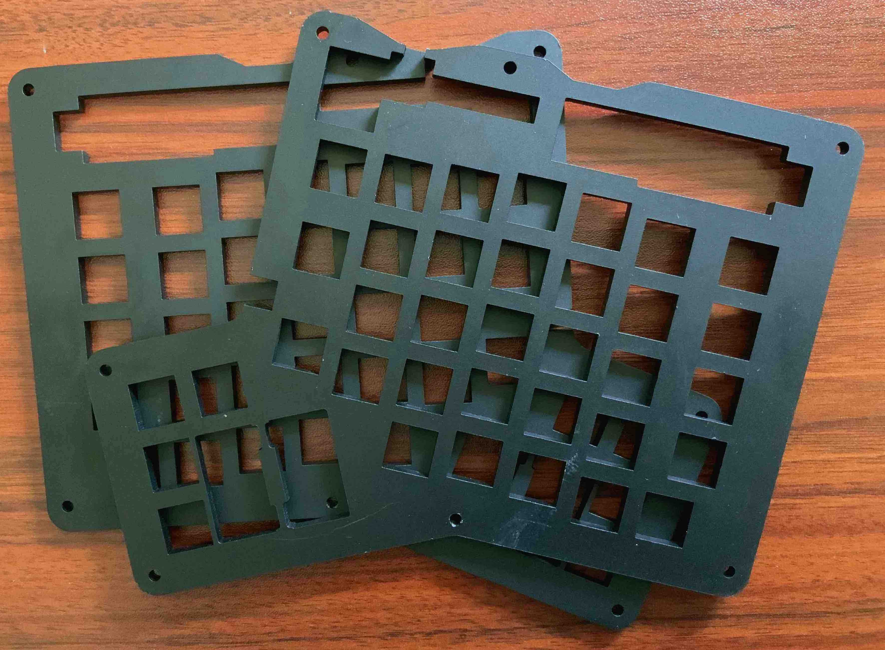

## 软件相关
使用了[Arduino IDE](https://www.arduino.cc/en/software), 基于[arduino_tmk_keyboard](https://github.com/bgould/arduino_tmk_keyboard).

代码使用方法是: 从Release里下载[bluetooth_ergodone.zip](https://github.com/shiqi-614/bluetooth_ergodone/releases/download/1.0/bluetooth_ergodone.zip), 在Arduino IDE里, 通过"项目" -> "加载库" -> "添加.zip库", 把本项目导入.

导入完成后, 还需要
1. **选择正确的示例程序**: 在Arduino IDE里, 通过"文件" -> "示例", 找到本项目名, 然后打开左手或者右手的示例程序,
2. **选择正确的开发板**: 在Arduino IDE里, 通过"工具" -> "开发板"里选择Arduino Leonardo,
3. **选择正确的端口**: 当电脑的USB连接到主控芯片(Arduino Pro Micro)后, 在"工具"->"端口"里会出现一个新的端口, 选择这个端口.

然后点Arduino IDE左上角的"上传"按钮, 就可以将代码上传到主控芯片里了.

在右手的示例程序里[right_hand.ino](https://github.com/shiqi-614/bluetooth_ergodone/blob/master/examples/right_hand/right_hand.ino), 可以通过ERGODONE_KEYMAP去定义自己的键盘布局, 支持多个键盘布局的切换, 比如我定义了三层, 第三层是鼠标的操作. 还可以自己定义一些宏操作, 比如在第二层里自定义了FN6, 按下这个键, 就会输出Hello, World. 更多玩法, 参考[tmk keymap](https://github.com/tmk/tmk_keyboard/blob/master/tmk_core/doc/keymap.md).

并且也是在右手的程序里[right_hand.ino](https://github.com/shiqi-614/bluetooth_ergodone/blob/master/examples/right_hand/right_hand.ino)通过各种hook函数控制LED灯.

我自己定义键盘布局里, 左手CAPS_LOCK按键的位置被我换了, 按成按着的时候, 会切换到第三层, 第三层是鼠标操作, 在第三层, 按下HJKL会移动鼠标. 原来Z键的位置, 被我换成按下切换到第二层, 这时候HJKL就变成方向键, 原来的Z向右移了一位.

# 最后的成品
### 正面
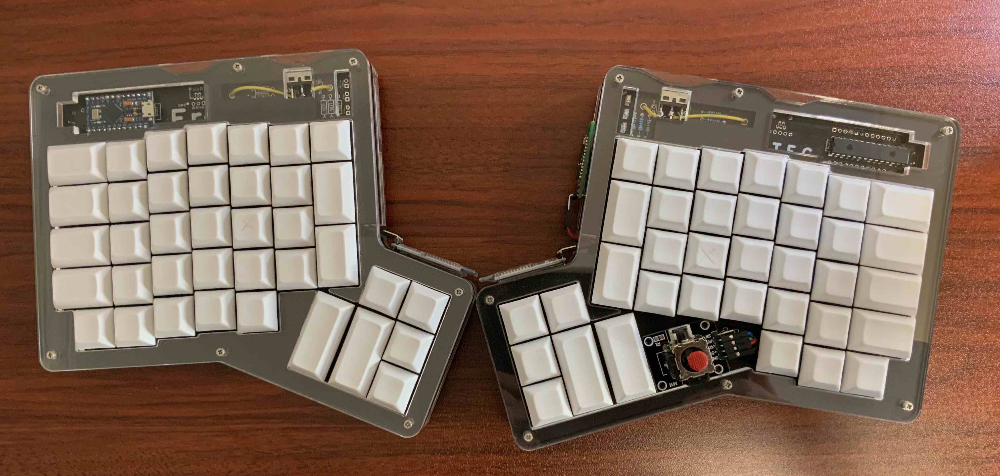

### 背面
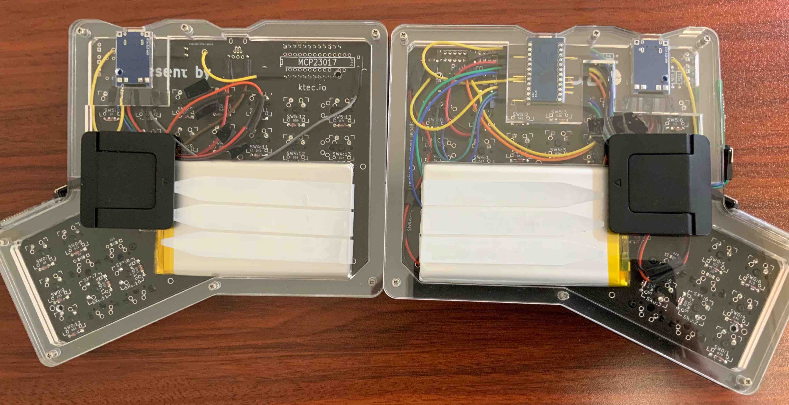

### 侧面
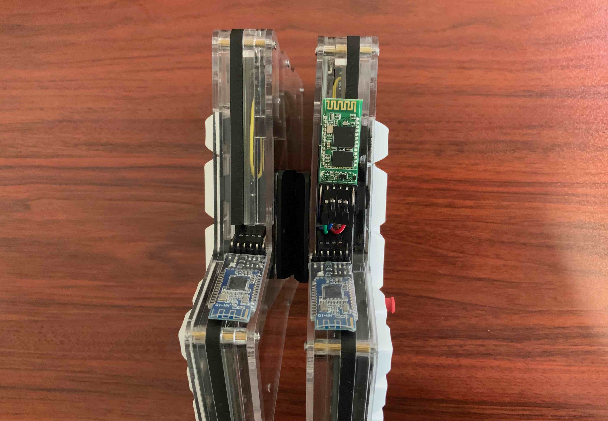

### 用起来的样子 
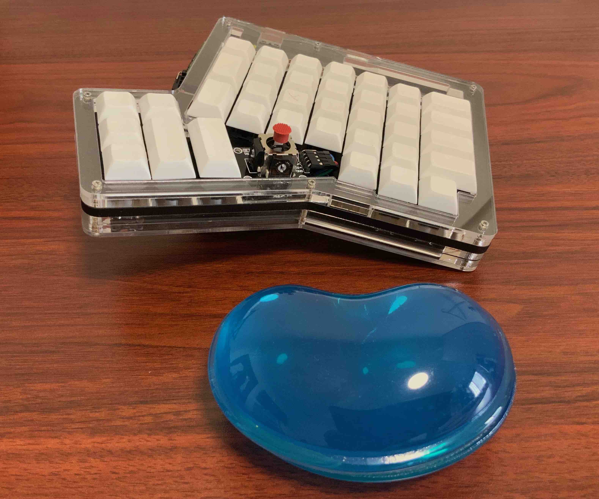

续航测试, 右手大概在360个小时之后, 开始出现连接不稳定, 左手这时候还能继续用, 左手没有继续测试下去.

测试过的能连接上的设备包括Mac电脑, windows电脑, ipad, iphone, 小米6.
