# 制作左手

## 系列文章列表
* [为什么要做一把蓝牙机械键盘](./chapter1_cn.md)
* [用到的东西](./chapter2_cn.md)
* [制作左手](./chapter3_cn.md)
* [设置左右手蓝牙BLE](./chapter4_cn.md)
* [制作右手](./chapter5_cn.md)
* [轴体焊接及供电模块](./chapter6_cn.md)
* [后记](./chapter_tips_cn.md)

### 理论说明
怎么样让左手的Arduino Pro Micro检测到哪一行, 哪一列的按键被按下或者松开了(即状态跟之前的不一样)呢? 

我们先介绍一下主控芯片的功能.

Arduino Pro Micro这块芯片有18个IO引脚, 其中所有的IO引脚都支持输入输出数字信息(就是0和1, 输出模式可以设置高电压或者低电压, 输出高电压就相当于电源, 输入模式可以读取当前电压高低), A0-A3这几个IO引脚支持输入输出模拟信息(可以表示连续的数字, 因为像摇杆, 很难只用0和1去表示. 因为我们除了想知道有没有向右移动, 还想知道移动了多少). 其他引脚的功能参考[hookup-guide](https://learn.sparkfun.com/tutorials/pro-micro--fio-v3-hookup-guide). 

在Arduino里设置输入输出模式非常简单, 可以通过如下命令 

<pre><code>pinMode(pin, OUTPUT); //设置引脚为输出模式. 
pinMode(pin, INPUT);  //设置引脚为输入模式.
</code></pre>

因为按键相当于一个开关, 我们可以把开关两侧接到电源VCC和一个IO引脚上, IO引脚设置为输入模式, 当开关按下, 通过读取电压的高低, 我们可以知道是否被按下. 

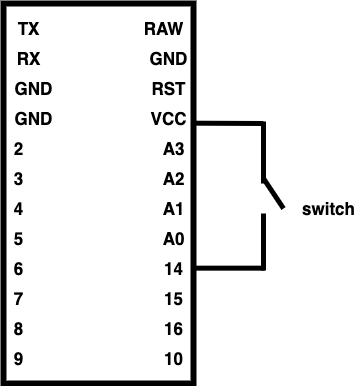

PS: 之前很好奇, 为什么仅靠一个引脚怎么能测出电压, 因为电压本质上是电势能差, 电势能和重力势能是一样的, 在位置比较高的物体(就是重力势能比较高的), 会向位置比较低的地方(重力势能比较低的地方)运动, 所以要知道电势差, 就得需要两点, 后来问了朋友, 可以简单理解成, 测的是与GND的电势差, 感兴趣可以搜索关键字"GPIO工作原理", 围观一下一个引脚里面有什么样的复杂电路.

这个想法很好, 但是有两个问题:
* 按键在没有按下的时候, 没有接到VCC电源, 这时候我们觉得IO引脚读到的电压应该低电压, 但是实际上不是这样的, IO引脚读到的是一个浮动的值, 可能是高电压, 也可能是低电压.
* 我们只有18个IO引脚, 而左手的开关(按键)有38个. 

第一个问题, 比较好解决, Arduino支持使用上拉电阻, 通过一个电阻与电源VCC相连, 固定在高电压. 从而避免这个问题. 在Arduino里使用上拉电阻的方法如下:
<pre><code> pinMode(pin, INPUT_PULLUP); //设置引脚为上拉电阻 </code></pre>

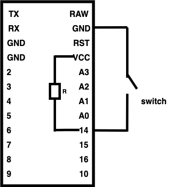</img>

如上图所示, 使用上拉电阻, 当按键按下, IO引脚能读到低电压, 因为接地GND了. 按键没有按下, 则是高电压, 因为接了电源VCC.  

第二个问题, 用到的解决方案叫矩阵式按键. 将键盘上的按键分成N行和M列, 用N + M个IO引脚去支持N * M个按键. 方法是先选中某一行, 其他行隐形, 然后依次判断这一行上的每一列有没有被按下.

如上图所示, 引脚10和16设置成了上拉电阻模式, 此时我们选中A0引脚所在的行, 首先设置为输出模式即
<pre><code> pinMode(A0, OUTPUT);
</code></pre>
然后设置为低电压(相当于接地)即
<pre><code> digitalWrite(A0, LOW);
</code></pre>

如果此时按键A按下了, 那么16引脚所在的那一列就能读到低电压, 即使这时候按键W按下了, 因为A3是高电压所以10引脚所在的那一列也是读到高电压. 按照这种方式, 选中其中一行设置为低电压, 其他行设置为高电压, 当有按键按下时, 我们就能知道哪一行, 哪一列按下了.

但是这会引起一个叫"Ghost Key"的问题, 就是你没按那个按键, 但是却检测到这个按键被按下去了. 如下图所示, 当你同时按下QAW三个按键时, S没有按下, 但是却被认为按下了. 

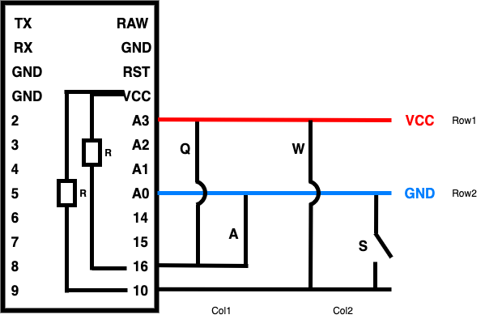

原因是从引脚10有办法连接到GND上. 

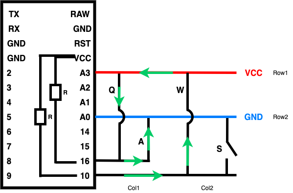

如上图所示, 沿着绿色箭头, 引脚10能连接到GND, 使得引脚10能读到低电压, 所以这时候S被认为是按下的. 解决方案就是用二极管(就是1n4148二极管), 规定电流只能往一个方向流过, 不让反方向的电流通过.   

如上图所示, 加上二极管之后, 电流就只能按照绿色箭头的方向移动, 这样引脚10的就无法和GND连接了. 

理论部分告一段落. 可以开始动手做了.

### 开始焊接左手

首先拿出一张PCB版, 和一个定位板, 因为这些都是左右手通用的, 所以不用害怕左右手弄混. 我们要把二极管焊在PCB板的背面, 因为需要保证定位板能紧紧贴合PCB板, 所以我们可以先用几个轴固定下定位板和PCB板.
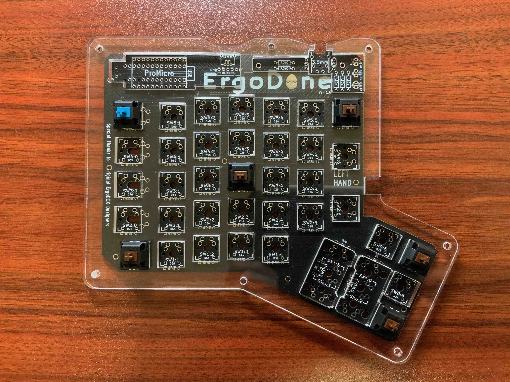

然后翻到反面, 把二极管焊上去, 要特别注意二极管的方向. 可以试试用电烙铁的刀头焊, 焊出来的焊点比较好看.
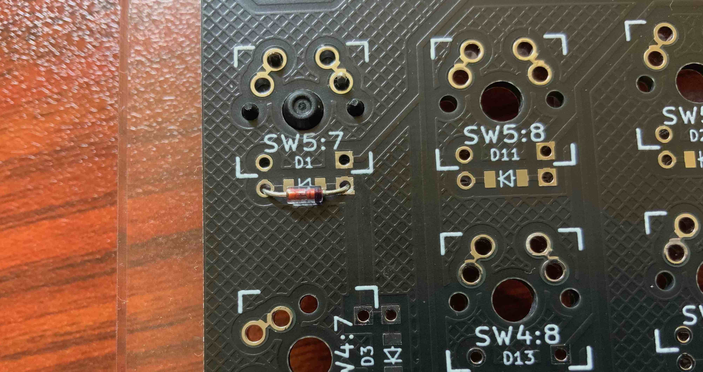

焊完后长这样, 注意每个按键下都要焊接一个二极管.
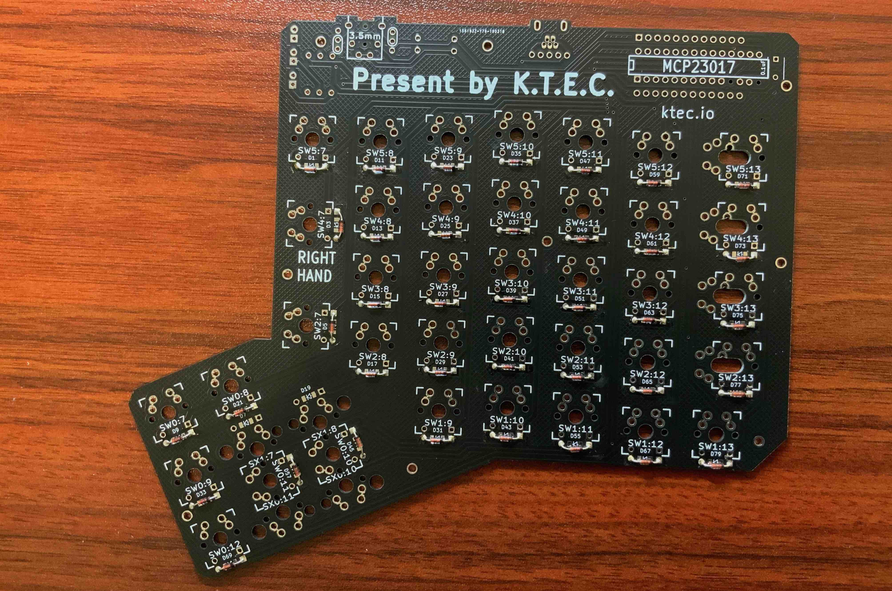

接着拿出Arduino Pro Micro, 然后安排上排针, 这里需要把RAW那个引脚的排针去掉, 因为RAW引脚用弯脚排针比较好, 方便连接到开关的杜邦线, 这个稍后处理. 

然后把左手的PCB翻到正面, 左上角已经为Arduino Pro Micro预设了位置, 上面写了ProMicro, 把Arduino Pro Micro放到上面去, 针脚放进对应的孔位.

然后把正面的焊接了, 背面的先不焊.
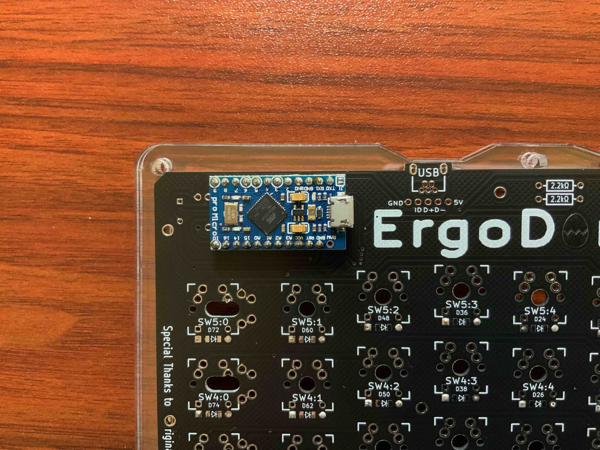

正面的焊好之后, 我们拿出一条杜邦线, 和一个弯脚排针, 只需要针, 然后放到杜邦线里.
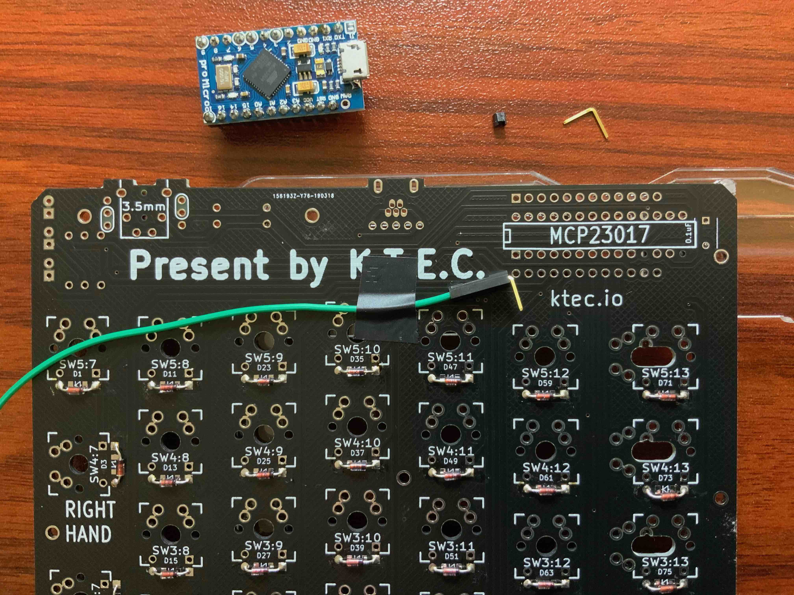

然后把这个弯脚排针放到RAW引脚对应的位置, 并用胶布固定一下. 
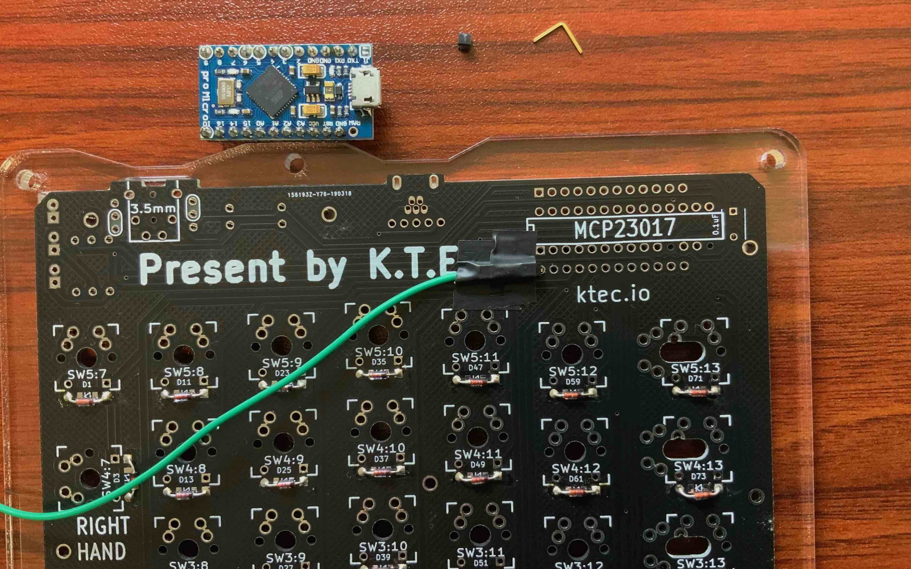

最后翻到正面, 把原来的Arduino Pro Micro放回去, 然后把RAW引脚给焊上去.
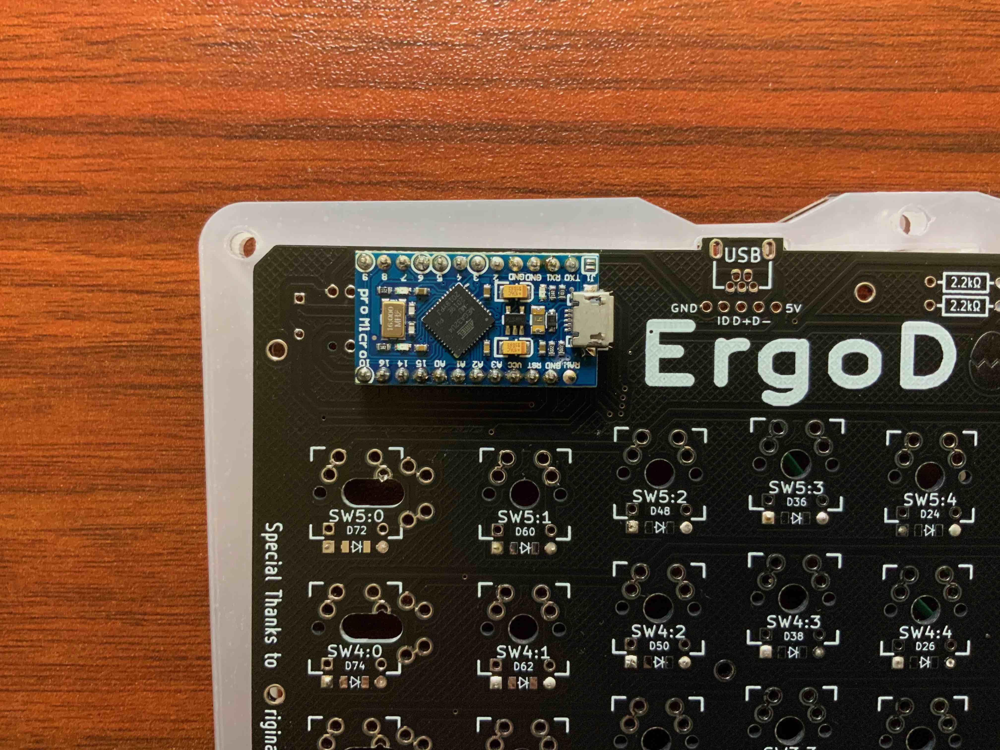

用类似的手法, 把下图里其他的位置, 也用弯脚排针焊上. 其中位置1的引脚是跟左手的HM-10进行数据交互的, 位置2是给左手的HM-10供电的, 位置3是给Arduino Pro Micro供电的.
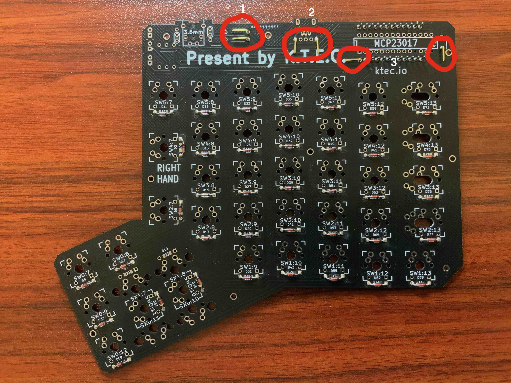

左手的焊接工作, 暂时告一段落. 

解释一下, 为什么要用弯脚排针这么焊, 后面的其他地方也会用到. 弯脚排针是配合杜邦线的, 这些地方当然也可以直接用跳线, 跟对应的芯片上的引脚焊死, 这么做首先是不太好焊, 然后如果以后想升级或者想更换某些硬件, 得先去掉原来的焊点, 再重新焊, 如果只是一两处还好, 如果焊点多了的话会比较麻烦, 如果是用弯脚排针再加上杜邦线, 就免去了这个麻烦. 

(因为经验有限, 没有办法保证现在的硬件方案是正确的, 那么希望以后发现更优秀的方案时, 能够以比较小的代价去修正.)

现在可以往左手的Arduino Pro Micro里写程序了, 打开Arduino IDE, 在"示例"里找到本项目里的"left_hand", 最后点"上传"就行了.

程序烧录上去后, 用一根导线, 去模拟按键按下.
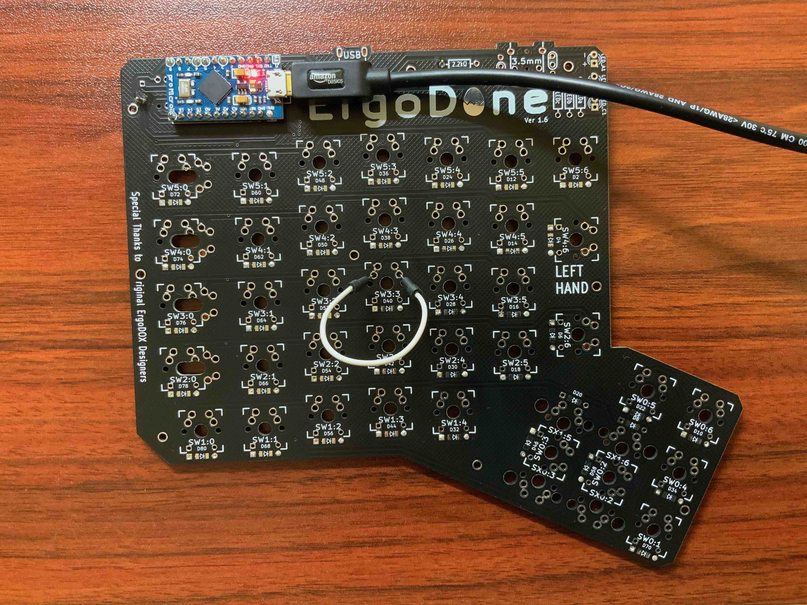
然后在Arduino IDE里打开"串口监视器", 就能看到程序输出哪一行被按下, 这一行哪所有按键的状态(16进制表示).
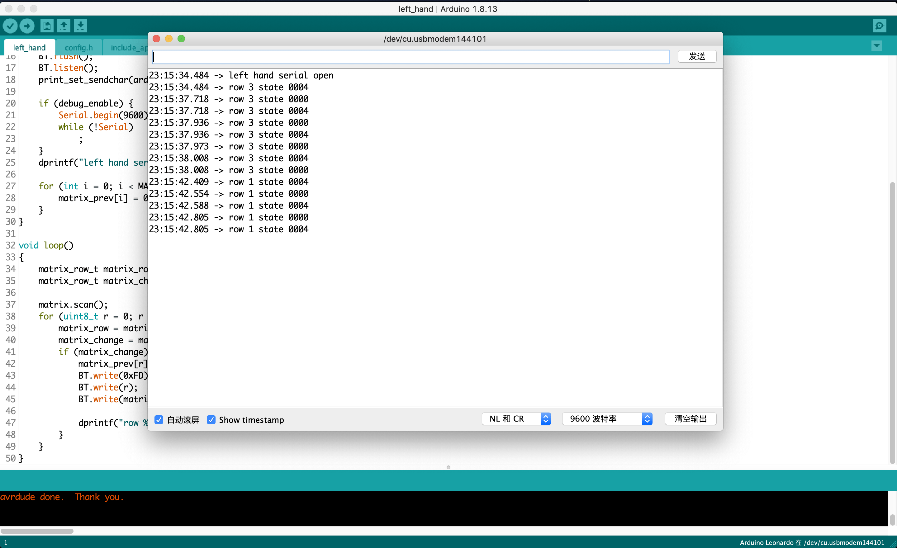
这里行和列对换了, 因为我在程序里是把一行所有按键状态发送出去了, 一个bit代表一个按键, 因为一个byte只有8个bit, 而一列不超过8个按键, 所以就把行和列对调了.

