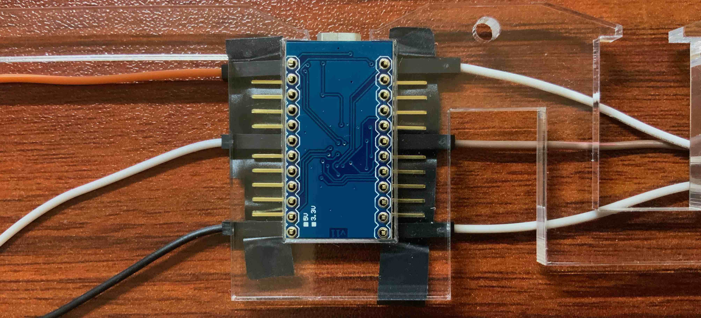

# 设置左右手蓝牙BLE

## 目录
* [为什么要做一把蓝牙机械键盘](./chapter1_cn.md)
* [用到的东西](./chapter2_cn.md)
* [制作左手](./chapter3_cn.md)
* [设置左右手蓝牙BLE](./chapter4_cn.md)
* [制作右手](./chapter5_cn.md)
* [轴体焊接及供电模块](./chapter6_cn.md)
* [后记](./chapter_tips_cn.md)

BLE跟普通蓝牙相比, 功率低, 成本低,  所以用来做左右手数据的传输.

在前一章, 我们已经把左手的PCB焊接好了, 现在我们开始设置左右手的HM-10, 让两块HM-10在上电之后, 能够自动连接, 并且左手的HM-10将数据发送给右手的HM-10(即设置主从模式). 

设置HM-10需要用串口发送AT指令. 如果你有USB转TTL的线, 并且使用的是windows系统, 那么这项工作会简单许多. 如果没有的话, 也有办法. 我们可以通过Arduino Pro Micro向HM-10发送AT指令.

首先拿出右手要用的Arduino Pro Micro, 弯脚排针, 装上排针, 插上几个杜邦线, 然后用胶带固定到下面的亚克力板上. 因为这块Arduino Pro Micro也是预计安装在这里的, 所以用这种方式焊, 可以避免最后这块凸起, 导致外壳合起来不严实. 针脚如果凸起, 可以用指甲刀剪掉一些.

焊好之后, 长这样. 

然后拿出左手的HM-10, HM-10的VCC和GND接Arduino Pro Micro的VCC和GND, 然后TXD接Arduino Pro Micro的RXD, RXD接Arduino Pro Micro的TXD. 

然后打开Arduino IDE, 找到示例里本项目里的"set_ble", 上传到Arduino Pro Micro里, 然后打开串口监视器, 就可以开始使用AT命令设置主从模式了. 输入"AT", 会返回"OK"(所有支持的指令可以去[官网](http://www.jnhuamao.cn/)上找), 输入"AT+ROLE0", 将当前这块HM-10设置为从设备, 然后放在一边. 接着拿出右手的HM-10, 按照相同的方法连接上, 输入"AT+ROLE2".

"AT+ROLE2"这个指令会自动搜索并连接信号强度最强的从设备, 根据文档"主从设备第一次连接的时候，只需要简单的放到一起即可，只要主设备记住了成功连接过的从设备，那么无论周围有多少个从设备，也不会发生误连接的情况。", 所以我们这时候把左手的HM-10上电, 两块HM-10放近些, 当两块HM-10上的红灯长亮, 就完成了主从配对.

主从配对完成后, 我们可以验证一下左手的HM-10确实给右手的HM-10发送正确的数据了. 拿出左手的PCB, 然后按照下图的方式连接. SDAM接HM-10的TXD, SCLM接HM-10的RXD, VCC和GND对应接上. 然后用USB给左手的Arduino Pro Micro供电. 这样就完成了配对.

为了验证左手的HM-10能给右手的HM-10发信息了. 打开示例本项目里的"test_ble", 上传到右手的Arduino Pro Micro里, 然后在左手PCB上用导线触发按键事件, 可以从串口监视器里看到左手传来的消息. FD开头, 接着是哪一行, 然后是行的状态(同样是16进制表示).

大功告成. 

这是很关键的一步.

这里先说一下我遇到的坑, 这里的HM-10从官方的淘宝店买最好(虽然运费最贵), 因为其他淘宝店的指令, 会和官方的不太一样, 这会导致连接不上, 指令不识别等问题. 我绕了很大一圈, 买了一条USB转TTL的线, 把自己linux的电脑装成windows, 下载windows才支持的对应串口程序去设置, 还是有问题...当然, 如果你熟悉HM-10等, 可以无识, 自己折腾.

