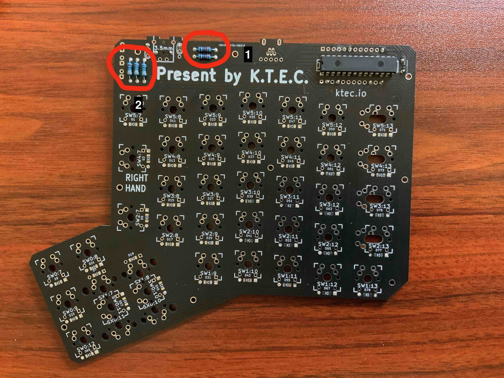
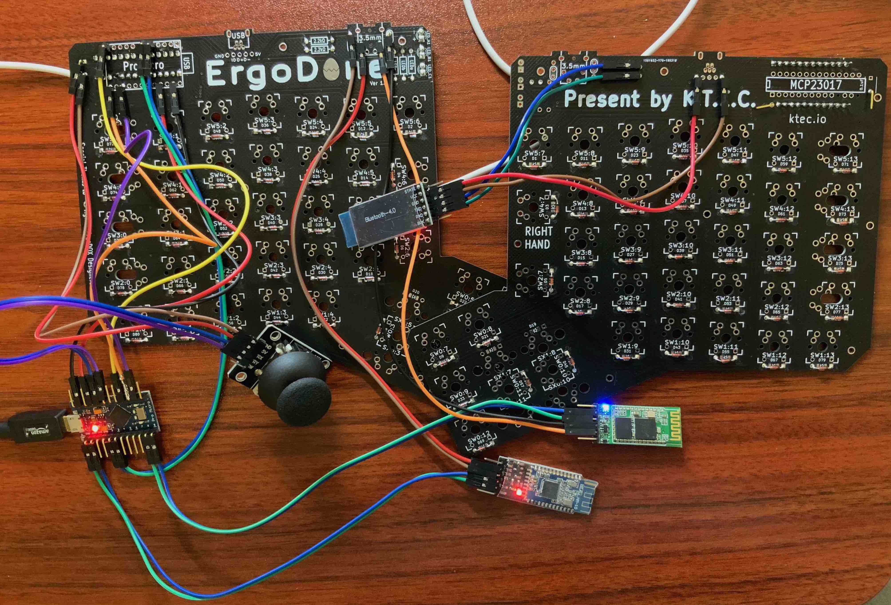

# 制作右手

## 系列文章列表
* [为什么要自己做一把蓝牙机械键盘](./chapter1_cn.md)
* [用到的东西](./chapter2_cn.md)
* [制作左手](./chapter3_cn.md)
* [设置左右手蓝牙BLE](./chapter4_cn.md)
* [制作右手](./chapter5_cn.md)
* [轴体焊接及供电模块](./chapter6_cn.md)
* [后记](./chapter_tips_cn.md)

在前面的章节里, 我们完成了左手的焊接, BLE的设置, 接下来开始制作右手, 右手会负责接受左手键盘发过来的信息, 摇杆信号的变化, 右手键盘的事件, 控制LED灯, 还负责跟电脑打交道. 可以用下图表示整个键盘各种模块之间的关系.

为什么要加一个MCP23017呢?

可以从上图看到, 右手的Arduino Pro Micro要负责的事情很多, 但是IO引脚数目有限, 如果像左手那样, 光监测键盘事件就把IO引脚基本占用完了, 所以用MCP23017去扩展IO引脚, 这个模组可以用2根IO引脚扩展出16根IO引脚, PCB上也给MCP23017预留了位置. 至于原理是什么, 有兴趣可以找一下MCP23017的datasheet, 里面介绍得很详细.

拿出一张PCB板, MCP23017, 按照下图放好, 特别要注意放的方向, 然后焊接上.

接下来把对应位置的电阻也焊接上. 位置1焊接2个2.2K殴的电阻, 位置2焊接3个330欧电阻, 这时候LED灯先不着急焊, 因为如果LED灯方向焊反了, 灯就亮不起来了.

然后翻到反面, 把二极管也焊接上, 并且在下面的几个位置也用之前教的方法, 焊上弯脚排针.

可以先把位置3456789连接上, 先测试LED和MCP23017是否正常工作,  完整的连接对应关系如下:

* 1 (VCC)    -> Joystick pin 5V
* 2 (GND)    -> Joystick pin GND
* 3 (LED A)  -> Arduino Pro Micro pin 15
* 4 (LED B)  -> Arduino Pro Micro pin 14
* 5 (LED C)  -> Arduino Pro Micro pin 16
* 6 (SCLM 与MCP23017通信的)  -> Arduino Pro Micro pin 3
* 7 (SDAM 与MCP23017通信的)  -> Arduino Pro Micro pin 2
* 8 (VCC)    -> Arduino Pro Micro pin VCC
* 9 (GND)    -> Arduino Pro Micro pin GND
* 10 (VCC)   -> HM-10 pin VCC
* 11 (GND)   -> HM-10 pin GND
* 12 (VCC)   -> Bluetooth HID pin VCC
* 13 (GND)   -> Bluetooth HID pin GND

另外, 还需要将HM-10, Bluetooth HID, Joystick数据传输的引脚跟Arduino Pro Micro相连, 具体如下:
* HM-10 pin TXD         -> Arduino Pro Micro pin RXD
* HM-10 pin RXD         -> Arduino Pro Micro pin TXD
* Bluetooth HID pin TXD -> Arduino Pro Micro pin 8
* Bluetooth HID pin RXD -> Arduino Pro Micro pin 9
* Joystick pin URX      -> Arduino Pro Micro pin A3
* Joystick pin URY      -> Arduino Pro Micro pin A2
* Joystick pin SW       -> Arduino Pro Micro pin A1

拿出之前焊好的右手的Arduino Pro Micro, 把位置3456789连接好之后, 打开示例, 找到本项目里的"test_mcp23017_led", 上传到Arduino Pro Micro里, 然后我们可以选三个自己觉得好看的LED灯, 放到对应的位置, 看是否能亮起来. 下图所示, 我选了黄色, 蓝色和绿色, 并且LED灯能正确亮起来, 这时候就可以放心地把LED焊上去.

这时候, 可以模拟下右手PCB上按键按下的事件. 如果能打印出对应的行和状态(这里是二进制表示), 那么MCP23017的功能也验证成功了.

那么现在, 除去充电供电模块外壳等, 你手上已经有一个完整的键盘了, 按照上面的列表, 把所有的连线通过杜邦线连接起来, 并且给左手的Arduino Pro Micro也上电, 这就完成了一个具备所有功能的键盘.

强烈建议这时候去试一下整个键盘的功能, 是否正常, 所有的按键能否正常响应, 摇杆能否正常工作, 之后把外壳等加上去, 检查出问题, 再修复就麻烦一些了.

