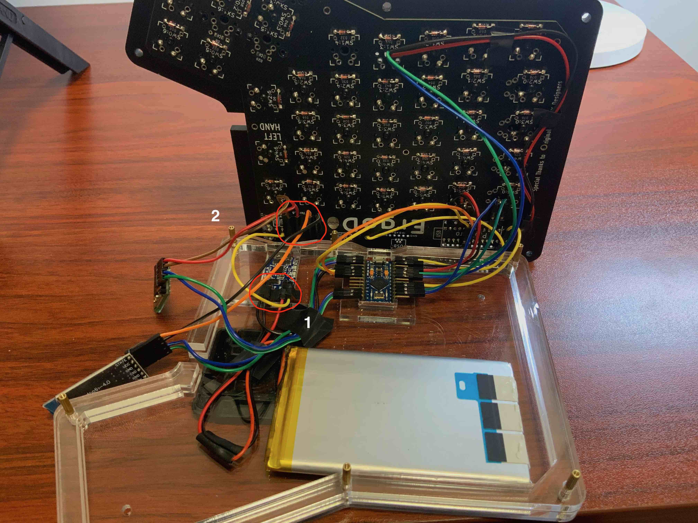

# 轴体焊接及制作供电模块

## 目录
* [为什么要做一把蓝牙机械键盘](./chapter1_cn.md)
* [用到的东西](./chapter2_cn.md)
* [制作左手](./chapter3_cn.md)
* [设置左右手蓝牙BLE](./chapter4_cn.md)
* [制作右手](./chapter5_cn.md)
* [轴体焊接及供电模块](./chapter6_cn.md)
* [后记](./chapter_tips_cn.md)

在前面的章节里, 硬件和软件都验证完成了, 接下来就可以把轴体焊接上去, 把供电模块加上去了.

如果你使用的时阳极铝定位板, 在焊轴之前, 最好把下面的二极管焊接点, 用黑胶布粘上. 避免阳极铝导电, 而造成的奇怪的现象.

在焊轴之前, 先把卫星轴安上去, 调试一下, 因为如果没有安装好, 会很影响手感.

然后把轴焊上去.

然后拿出一块TP4056充电模块, 拿出放充电模块的外壳和一个只有边框的外壳. 按照下图的方式放在一起, 然后同样用弯脚排针放进充电模板的引脚里, 用胶布固定在外壳上.

翻过来, 把充电模块上的弯脚排针焊上. 只有边框的外壳, 是放在PCB板和电池之间, 提供一些空间, 避免直接接触, 也能卡住充电模板, 避免掉下来, 如果不放心, 也可以用黑胶布多固定一下. 焊好之后, 如下图.

接下来处理锂电池, 拿出一个锂电池, 把它跟杜邦线接在一起, 具体做法是把杜邦线切成两半, 然后把塑料外壳去掉一些, 我是正面划一刀, 背面划一刀, 然后剥开, 锂电池对应红黑线的地方也做相同的处理, 然后把它们缠在一起, 用焊锡加固一下, 再用黑胶布包一下.

 
拿出一个拨动开关, 同样是把杜邦线一头的塑料外壳去掉一些, 缠到开关相邻的的脚上, 用焊锡固定. 右手的开关的杜邦线弄长一些, 因为右手键盘里的线太多了, 理线比较有发挥空间.

因为供电模块两手各一组, 所以把两组都处理完.

然后拿出底下两层外壳, 用铜柱及螺丝固定上, 给电池装上易拉胶(蓝色那一面先撕起来), 放上去, 同时把充电模组也放上去, 线按照下图的方式接上.

正面装上开关, 这里需要把杜邦线上的塑料头去掉, 才能通过PCB板上的洞, 通过之后, 再把塑料头装上.

背面这样连接.

然后组合起来, 把接到拨动开关的另一条线, 接到充电模块的OUT+口. 充电模块的OUT-, 接到PCB板上剩下的弯脚排针上. 左手基本上就完成了, 剩下就是把其他的外壳装上去.

组装右手的过程, 比较类似, 摇杆我装在下图的位置, 小红点, 不能直接安装到摇杆上, 我是里面塞了点东西, 然后用胶水粘上, 也可以先试试原来摇杆自带的蘑菇帽用得感觉怎么样, 觉得不行再换. 还有, 摇杆模组里的电路极右上角要剪掉一小块, 不然有个按键按不下.

右手的安装过程, 比较类似, 充电模块的OUT-直接用杜邦线连接到Arduino Pro Micro的随便一个GND口. 剩下就是整理线, 让外壳能合上.

上图的位置1和位置2合起来的时候, 会压到一起, 因为位置2是给两组VCC和GND口, 离得比较开, 可以把杜邦线的塑料头去掉, 然后用胶布封起来, 减少了一些厚度, 位置1最好不要这么做, 因为距离太近了, 而且是和锂电池直接连接的, 小心一些好.

好了, 最后就是把外壳合上, 然后用纳米双面胶把HM-10和Bluetooth HID模组粘在外壳上.

键盘做完了.

